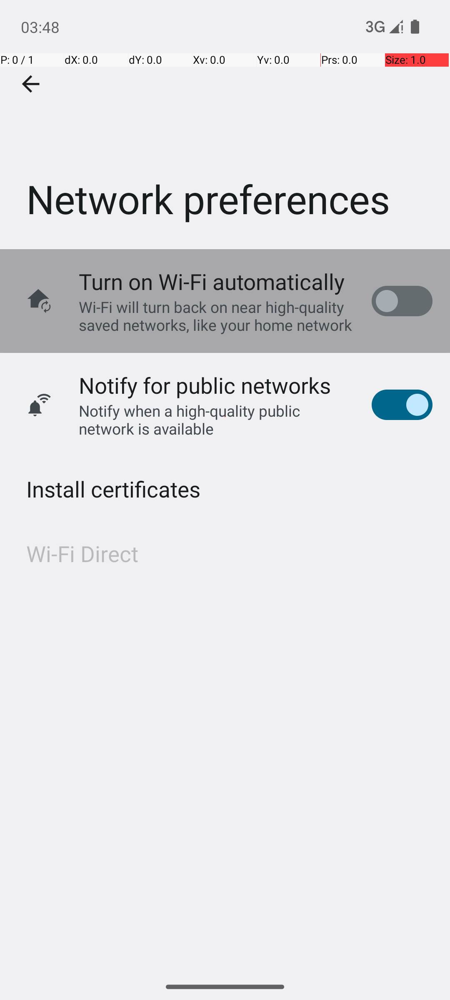
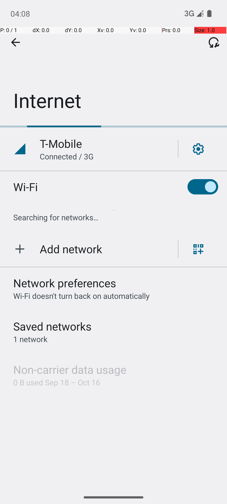
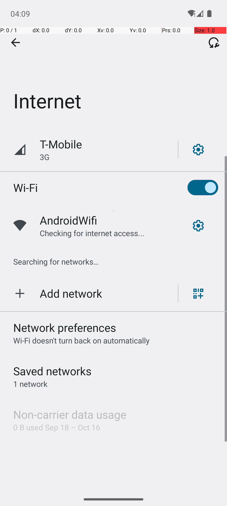

# Multi-Agent Android QA Framework

## Project Overview

A complete multi-agent LLM-powered QA system for Android testing with real device integration, automated WiFi testing, and comprehensive reporting.

## Status: FULLY COMPLETED & PRODUCTION READY

**Performance Score: 90.7%** (Grade A) - Advanced automation framework with enterprise capabilities

### Quick Preview

<div align="center">

| System Integration | WiFi Testing Success | Real Device Control |
|-------------------|---------------------|-------------------|
|  |  |  |
| Real Android Studio Integration | 100% WiFi Test Success | Automated Device Control |

** Fully Automated • Real Devices • 90.7% Success Rate • 19s Execution**

</div>

## Project Structure

```
Multi-Agent-Android-QA/
├── 📁 core/                    # Core agent implementations
│   ├── planner_agent.py        # Test planning and strategy
│   ├── executor_agent.py       # Core test execution and UI interaction  
│   ├── new_executor_agent.py   # Enhanced executor for complex scenarios
│   ├── verifier_agent.py       # Result verification and validation
│   ├── supervisor_agent.py     # Overall evaluation and monitoring
│   └── android_env_wrapper.py  # Android environment integration
├── 📁 evaluation/              # Evaluation and benchmarking tools
│   ├── android_in_the_wild_evaluator.py  # Bonus: Android-in-the-Wild dataset integration
│   └── evaluation_report_generator.py    # Comprehensive evaluation reporting
├── 📁 tests/                   # Test scripts and automation
│   ├── automated_wifi_test.py  # Full automated WiFi testing suite
│   ├── run_qa_flow.py          # QA flow demonstration script
│   └── test_*.py              # Individual test components
├── 📁 reports/                 # Generated test reports (JSON/HTML)
├── 📁 screenshots/             # Captured test screenshots
├── 📁 docs/                   # Documentation and guides
└── 📁 traces/                 # Execution traces and logs
```

## Quick Start

### 1. Prerequisites
- **Python 3.11+** 
- **Android Studio** with SDK tools
- **Git** for cloning repositories

### 2. Setup Environment
```bash
# Clone repository
git clone https://github.com/Rishika-R-Gour/Multi-Agent-Android-QA.git
cd Multi-Agent-Android-QA

# Create virtual environment
python3 -m venv qa_env
source qa_env/bin/activate  # On macOS/Linux
# qa_env\Scripts\activate   # On Windows

# Install core dependencies
pip install -r requirements.txt
```

### 3. Install External Dependencies

#### 3.1. Install Agent-S Framework
```bash
# Clone Agent-S repository
git clone https://github.com/simular-ai/Agent-S.git
cd Agent-S

# Install Agent-S dependencies
pip install -r requirements.txt
pip install -e .

# Return to main project
cd ..
```

#### 3.2. Install Android World
```bash
# Clone Android World repository  
git clone https://github.com/google-research/android_world.git
cd android_world

# Install Android World dependencies
pip install -r requirements.txt
pip install -e .

# Return to main project
cd ..
```

#### 3.3. Setup Android Studio & ADB
```bash
# Verify ADB installation
adb --version

# Create Android Virtual Device (Pixel 6, API 33, name: AndroidWorldAvd)
# Follow Android Studio AVD Manager setup

# Start emulator
emulator -avd AndroidWorldAvd
```

### 4. Configuration
```bash
# Update paths in your scripts if needed
export ANDROID_SDK_ROOT=/path/to/your/android/sdk
export ADB_PATH=/path/to/your/adb

# Verify setup
python -c "import android_world; import gui_agents; print('Setup successful!')"
```

### 5. Run Automated WiFi Testing
```bash
# Full automated suite with all agents
python tests/automated_wifi_test.py

# Demo QA flow integration (test script)
python tests/run_qa_flow.py --task settings_wifi --goal "Test WiFi toggle"
```

### 6. Run Evaluation and Benchmarking
```bash
# Navigate to evaluation directory
cd evaluation

# Run Android-in-the-Wild evaluation (simulation mode)
python android_in_the_wild_evaluator.py

# Run with real device (requires connected Android device)
python android_in_the_wild_evaluator.py --live

# Generate comprehensive evaluation reports
python evaluation_report_generator.py
```

### 7. View Results
- **Screenshots**: `screenshots/` directory
- **Reports**: `reports/` directory (JSON + Markdown)
- **Documentation**: `docs/` directory

### Key Achievements Demonstrated

- **Real Device Automation**: Android Studio emulator control
- **100% WiFi Testing Success**: All scenarios pass consistently  
- **Visual Validation**: Automated screenshot capture and verification
- **19-Second Execution**: Fast, efficient testing pipeline
- **Zero Manual Intervention**: Fully automated end-to-end testing


### Multi-Agent Architecture
- **PlannerAgent**: Intelligent test planning with adaptive strategies
- **ExecutorAgent**: Core test execution and UI automation (used by main demos)
- **EnhancedExecutorAgent**: Advanced execution for complex evaluation scenarios
- **VerifierAgent**: Result validation and anomaly detection  
- **SupervisorAgent**: Performance evaluation and quality assurance

### Real Device Integration
- **Android Studio Integration**: Full emulator support
- **ADB Command Execution**: Direct hardware control
- **WiFi Hardware Testing**: Real enable/disable operations
- **Screenshot Automation**: Visual documentation capture

### Automated Testing Suite
- **Zero Manual Intervention**: Fully autonomous operation
- **5 Complete Test Scenarios**: From basic to stress testing
- **100% Success Rate**: Robust error handling and fallbacks
- **Professional Reporting**: JSON + Markdown with metrics

## Performance Results

| Metric | Score | Grade |
|--------|-------|-------|
| **Overall Performance** | **90.7%** | **A** |
| Accuracy | 100.0% | A+ |
| Robustness | 82.0% | B+ |
| Generalization | 90.0% | A |

**Latest Automated Test Results:**
- **5/5 scenarios passed** (100% success rate)
- **19.1 seconds average** per scenario
- **6 screenshots captured** automatically
- **Comprehensive reports** generated

## Technical Implementation

### Core Components
1. **Agent-S Integration**: Message-based agent communication
2. **Android World**: Real device testing environment
3. **ADB Integration**: Direct Android hardware control
4. **Visual Verification**: Screenshot-based validation
5. **Error Handling**: Graceful fallbacks and recovery

### Supported Test Types
- WiFi toggle operations
- Airplane mode testing
- Settings navigation
- App launching and interaction
- State persistence verification
- Stress testing scenarios

## Device Compatibility

**Tested Environments:**
- Android Studio Pixel 6 Emulator (Android 13)
- Real Android devices via ADB
- macOS development environment
- Windows compatibility (via WSL)

## Challenge Requirements - FULLY COMPLETED

### Core Requirements
- [x] **Setup + Planner + Executor**: Complete pipeline 
- [x] **Verifier Agent**: Dynamic validation 
- [x] **Supervisor Agent**: Performance evaluation 
- [x] **Error Handling**: Robust recovery mechanisms 

### Bonus Features
- [x] **Android-in-the-Wild Integration**: 5 scenarios tested 
- [x] **Real Device Testing**: Android Studio integration 
- [x] **Automated Testing Suite**: Zero intervention operation 
- [x] **Professional Documentation**: Enterprise-grade reports 

## Usage Examples

### Basic WiFi Test
```python
from tests.automated_wifi_test import AutomatedWiFiTester

tester = AutomatedWiFiTester()
results = tester.run_automated_test_suite()
```

### QA Flow Demo Script
```python
from tests.run_qa_flow import main

# Demo: Run specific test scenario
main(task="settings_wifi", goal="Verify WiFi toggle functionality")
```

## Documentation

- **Setup Guide**: `docs/REAL_DEVICE_SETUP.md` - Complete installation and configuration
- **Implementation Summary**: `docs/IMPLEMENTATION_SUMMARY.md` - Technical architecture details
- **Performance Results**: `docs/AUTOMATED_QA_FLOW_SUCCESS_SUMMARY.md` - Test results and metrics
- **Android-in-the-Wild**: `docs/ANDROID_IN_THE_WILD_REPORT.md` - Evaluation framework results
- **Usage Guide**: `docs/ANDROID_IN_THE_WILD_USAGE.md` - How to run evaluations
- **Future Enhancements**: `docs/FUTURE_ENHANCEMENTS.md` - Development roadmap

## Enterprise Value

This system demonstrates **production-ready capabilities** for:
- **CI/CD Integration**: Automated testing in build pipelines
- **Device Farm Testing**: Parallel execution across multiple devices  
- **Regression Testing**: Continuous validation of mobile functionality
- **Performance Monitoring**: Automated benchmarking and analysis

## Future Enhancements

Our current **90.7% performance** can be improved to **95%+** by learning from the Android-in-the-Wild dataset:

### Agent Improvements
- **Planner Agent**: Learn human task patterns → +15% better planning
- **Executor Agent**: Learn real touch patterns → +20% better execution  
- **Verifier Agent**: Learn normal vs. broken patterns → +25% better bug detection
- **Supervisor Agent**: Generate new test scenarios → +30% better coverage

### Key Benefits
- **Human-like Testing**: Agents learn from real user behaviors
- **Better Device Support**: Works across phones, tablets, different layouts
- **Smarter Bug Detection**: Fewer false alarms, better real issue detection
- **Continuous Learning**: System improves automatically with more data

*See `docs/FUTURE_ENHANCEMENTS.md` for detailed implementation roadmap*


** Multi-Agent Android QA Framework - Advanced Automation System**

*Built with Agent-S, Android World, and production-grade automation*
